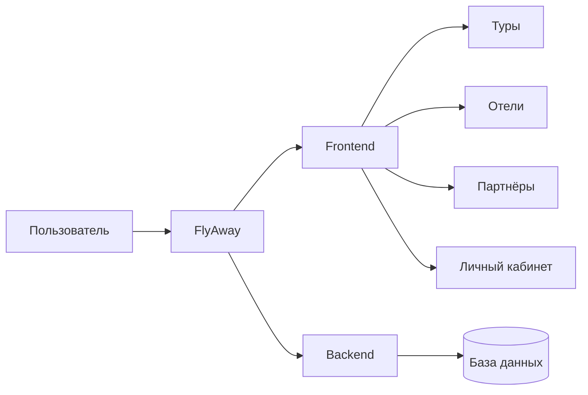

  

<h1 align="center">FlyAway</h1>

  Единая цифровая платформа для удобного поиска туров, отелей и туристических предложений

---

## О проекте

**FlyAway** — это современный туристический сервис, который помогает пользователю находить варианты для отдыха в одном месте. Платформа объединяет туры, отели, партнёрские предложения и личный кабинет в единую удобную систему.

Проект разработан **в рамках рынка Казахстана** и ориентирован на пользователей, туристические предложения и цифровые сценарии, актуальные именно для этой страны.

Главная идея проекта — сделать поиск путешествий более понятным, быстрым и приятным. Пользователь может не только просматривать предложения, но и глубже знакомиться с ними, сравнивать варианты и сохранять интересующие позиции.

---

## Цель проекта

Цель FlyAway — создать удобную онлайн-платформу для путешественников **в Казахстане**, где весь путь пользователя строится просто и логично:

- познакомиться с сервисом;
- выбрать тур или отель;
- изучить подробности;
- сохранить понравившиеся предложения;
- управлять своими данными и активностью в личном кабинете.

Проект ориентирован на понятный интерфейс, аккуратную подачу информации и комфортное взаимодействие с сервисом как с компьютера, так и с мобильных устройств.

---

## Схема системы

В общей логике проект работает просто: пользователь взаимодействует с сайтом, сайт показывает ему интерфейс и страницы, а серверная часть обрабатывает данные и передаёт нужную информацию из базы данных.

---

## Основной функционал

FlyAway включает в себя несколько ключевых возможностей для пользователей и туристического рынка Казахстана:

- главную страницу с баннерами, подборками и акцентными предложениями;
- каталог туров с карточками и подробным описанием;
- каталог отелей с просмотром доступных вариантов;
- раздел партнёров проекта;
- детальные страницы с расширенной информацией;
- личный кабинет пользователя;
- избранное, покупки и история действий;
- авторизацию и работу с профилем;
- адаптивный интерфейс для разных устройств;
- поддержку казахского и русского языков.

---

## Как устроен проект

FlyAway состоит из двух основных частей:

### Frontend

Frontend отвечает за внешний вид и взаимодействие с пользователем. Именно здесь находятся страницы сайта, каталоги, карточки туров и отелей, формы, кнопки, модальные окна и личный кабинет.

### Backend

Backend отвечает за хранение и обработку данных. Он работает с пользователями, авторизацией, турами, отелями, партнёрами, баннерами и другой информацией, которая отображается на сайте.

Вместе эти две части образуют единую цифровую платформу, где всё работает как одно целое.

---

## Архитектура

Архитектура проекта построена вокруг пользовательского пути. Каждый большой раздел решает свою задачу:

- **Главная страница** знакомит пользователя с сервисом;
- **Туры** помогают выбрать направление и формат путешествия;
- **Отели** дают возможность изучить варианты проживания;
- **Партнёры** расширяют экосистему проекта;
- **Личный кабинет** объединяет данные пользователя и его активность.

Такой подход делает проект понятным и последовательным: пользователь не теряется в структуре и легко находит нужный раздел.

---

## Технологический стек

Проект реализован с использованием современных веб-технологий.

| Направление | Используемые технологии |
| --- | --- |
| Клиентская часть | `Nuxt 3`, `Vue 3` |
| Серверная часть | `Node.js`, `Express` |
| База данных | `MongoDB` |
| Состояние приложения | `Pinia` |
| Интерфейс и стили | `PrimeVue`, `SCSS` |
| Мультиязычность | `@nuxtjs/i18n` |
| Дополнительные возможности | `Swiper`, `Maska`, `Yandex Maps API`, `JWT` |

---

## Команда проекта

| Участник | Роль |
| --- | --- |
| Иса Нартайулы | FullStack Developer |
| Нурым Бейсембай | FullStack Developer |

---

## Ресурсы проекта

- Сайт проекта: `https://flyaway-project.vercel.app/`
- Дизайн в Figma: `https://www.figma.com/design/7RboslqK2lxF06orUl1CnH/SaparTime.kz-(Copy)?t=Wq1z9xdl2JtjDTFI-0`
- Backend API: `https://api-flyaway-project.vercel.app/`

---

## Ценность проекта

FlyAway — это не просто сайт с туристическими предложениями. Это попытка создать цельный цифровой сервис для рынка Казахстана, в котором пользователю удобно двигаться от интереса к путешествию до выбора конкретного предложения.

Проект объединяет визуальную часть, данные, пользовательские сценарии и структуру сервиса в одном продукте. Благодаря этому FlyAway можно рассматривать как полноценную платформу для цифрового туристического опыта.

---

## Итог

FlyAway — это проект, который сочетает в себе удобный интерфейс, понятную структуру и функциональность, необходимую для современного туристического сервиса Казахстана. Он охватывает как пользовательскую часть, так и серверную логику, и формирует единое решение для работы с турами, отелями и туристической экосистемой в рамках страны.
