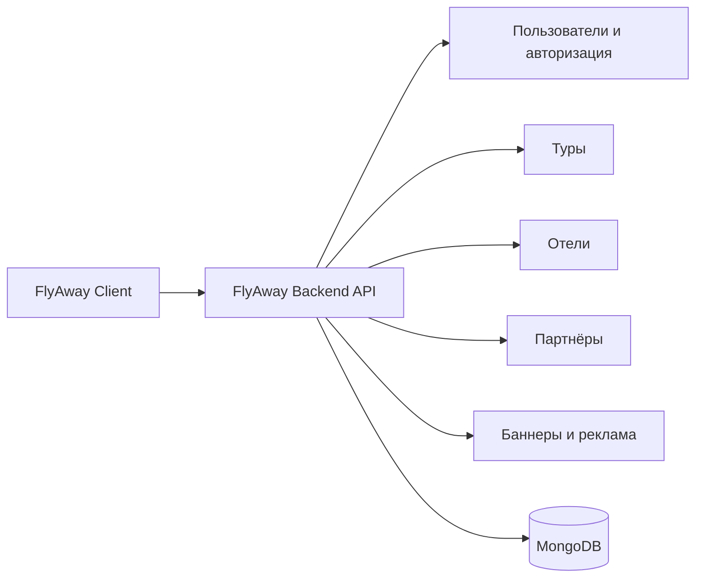

<p align="center">
  
</p>

<h1 align="center">FlyAway Backend</h1>

<p align="center">
  Серверная часть платформы FlyAway для работы с пользователями, турами, отелями, партнёрами и контентом сайта
</p>

---

## О проекте

**FlyAway Backend** — это серверная часть проекта FlyAway, которая отвечает за хранение и обработку данных, работу с пользователями и связь клиентского приложения с базой данных.

Backend обеспечивает работу основных разделов платформы: туров, отелей, партнёров, баннеров, рекламных блоков и личного кабинета пользователя.

---

## Схема системы



Сервер принимает запросы от клиентской части, обрабатывает бизнес-логику, взаимодействует с базой данных и возвращает готовые данные для отображения на сайте.

---

## Основной функционал

- регистрация и авторизация пользователей;
- подтверждение регистрации по коду;
- вход в систему и получение данных текущего пользователя;
- восстановление и сброс пароля;
- обновление профиля пользователя;
- получение списка туров и отдельного тура;
- получение списка отелей и отдельного отеля;
- получение списка партнёров и отдельного партнёра;
- управление баннерами и рекламными блоками;
- тестовая загрузка файлов в Blob Storage.

---

## Архитектура

Структура backend-проекта разделена на несколько понятных частей:

- **`server/routes/`** — маршруты API;
- **`server/controllers/`** — обработка логики запросов;
- **`server/models/`** — модели данных MongoDB;
- **`server/middleware/`** — промежуточные обработчики и сервисные модули;
- **`config/`** и **`server/config/`** — подключение базы данных и внешних сервисов;
- **`public/`** — статические файлы.

Такой подход делает проект удобным для поддержки и дальнейшего расширения.

---

## Технологический стек

| Категория | Технологии |
| --- | --- |
| Backend | `Node.js`, `Express` |
| Database | `MongoDB`, `Mongoose` |
| Authentication | `JWT`, `bcrypt` |
| File Storage | `@vercel/blob`, `Cloudinary` |
| Email | `Nodemailer` |
| Configuration | `dotenv` |

---

## API Разделы

| Раздел | Назначение |
| --- | --- |
| `/api/users` | пользователи, авторизация, профиль, сброс пароля |
| `/api/tours` | туры и детальные данные по турам |
| `/api/hotels` | отели и карточки отелей |
| `/api/partners` | партнёры проекта |
| `/api/banners` | баннеры для клиентской части |
| `/api/ads` | рекламные блоки |
| `/api/dev` | служебные dev-эндпоинты |

---

## Команда

| Участник | Роль |
| --- | --- |
| Иса Нартайулы | FullStack Developer |
| Нурым Бейсембай | FullStack Developer |

---

## Ресурсы

- Frontend: `https://flyaway-project.vercel.app/`
- Figma: `https://www.figma.com/design/7RboslqK2lxF06orUl1CnH/SaparTime.kz-(Copy)?t=Wq1z9xdl2JtjDTFI-0`
- Backend API base: `https://api-flyaway-project.vercel.app/api/`

---

## Запуск проекта

```bash
npm install
npm run dev
```

Для обычного запуска можно использовать:

```bash
npm run start
```

По умолчанию сервер запускается на порту, указанном в `.env`.

---

## Переменные окружения

Для запуска проекта необходимо создать `.env` файл и указать в нём основные параметры подключения, например:

```env
MONGODB_USER=your_mongodb_user
MONGODB_PASSWORD=your_mongodb_password
PORT=3001
JWT_SECRET=your_jwt_secret
```

Если используются внешние сервисы для хранения файлов или отправки почты, их ключи также должны быть добавлены в переменные окружения.
