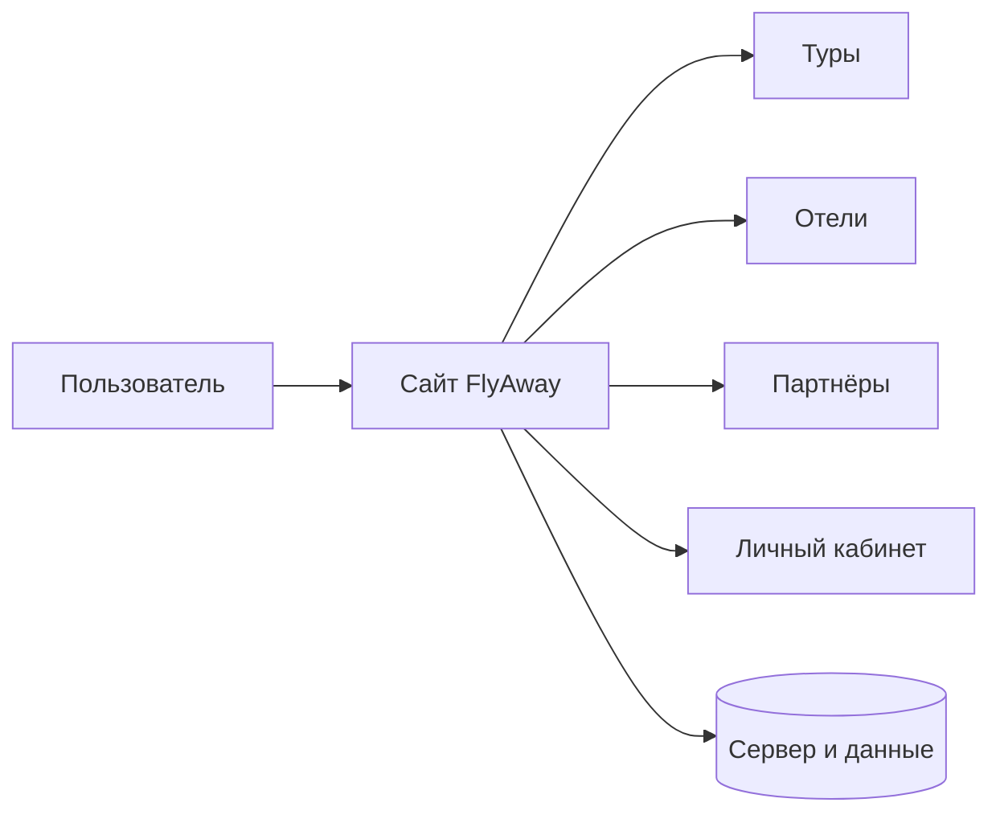

<p align="center">
  
</p>

<h1 align="center">FlyAway</h1>

<p align="center">
  Платформа для удобного поиска туров, отелей и полезных предложений для путешествий
</p>

---

## О проекте

**FlyAway** — это веб-платформа для путешественников, которая помогает находить подходящие варианты отдыха в одном месте. Сервис объединяет туры, отели и партнёрские предложения в удобный и понятный интерфейс.

Проект создан для того, чтобы сделать процесс выбора путешествия проще, быстрее и нагляднее. Пользователь может просматривать предложения, изучать подробную информацию, сохранять интересующие варианты и работать со своим личным кабинетом.

---

## Схема системы



Эта схема показывает общую логику работы проекта: пользователь взаимодействует с сайтом, переходит по основным разделам, а нужная информация подгружается из серверной части.

---

## Основной функционал

- просмотр туров с подробным описанием;
- просмотр отелей и доступных вариантов размещения;
- каталог партнёров проекта;
- детальные страницы с информацией о предложениях;
- личный кабинет пользователя;
- избранное, покупки и история взаимодействия;
- адаптивный интерфейс для компьютеров и мобильных устройств;
- поддержка двух языков: казахского и русского.

---

## Архитектура

Проект состоит из нескольких основных частей, каждая из которых отвечает за свой пользовательский сценарий:

- **Главная страница** знакомит пользователя с сервисом и показывает ключевые предложения.
- **Раздел туров** помогает выбрать путешествие по интересам.
- **Раздел отелей** позволяет найти подходящее место для проживания.
- **Раздел партнёров** представляет дополнительные предложения и участников экосистемы.
- **Личный кабинет** объединяет информацию о пользователе, его избранных предложениях и покупках.

Такой подход делает проект целостным и удобным для навигации: каждый раздел решает свою задачу, но все вместе они формируют единый пользовательский путь.

---

## Технологический стек

| Категория | Технологии |
| --- | --- |
| Основа проекта | `Nuxt 3`, `Vue 3` |
| Интерфейс | `PrimeVue`, `SCSS` |
| Управление состоянием | `Pinia` |
| Мультиязычность | `@nuxtjs/i18n` |
| Дополнительные возможности | `Swiper`, `Maska`, `Yandex Maps API` |

---

## Команда

| Участник | Роль |
| --- | --- |
| Иса Нартайулы | FullStack Developer |
| Нурым Бейсембай | FullStack Developer |

---

## Ресурсы

- Сайт проекта: `https://flyaway-project.vercel.app/`
- Дизайн в Figma: `https://www.figma.com/design/7RboslqK2lxF06orUl1CnH/SaparTime.kz-(Copy)?t=Wq1z9xdl2JtjDTFI-0`
- Backend API: `https://api-flyaway-project.vercel.app/`

---

## Запуск проекта

```bash
npm install
npm run dev
```

После запуска проект будет доступен локально на `http://localhost:3000`.
