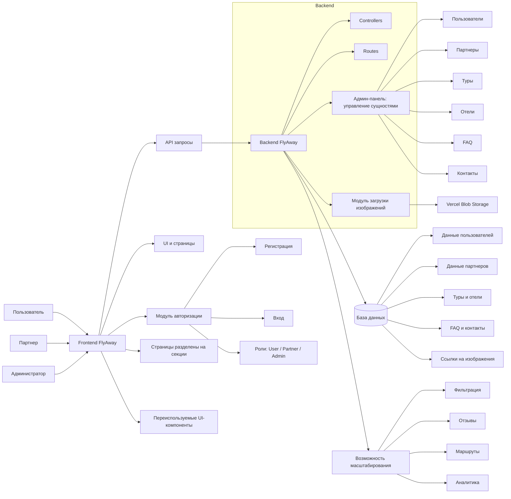

```mermaid
flowchart LR
    A[Пользователь] --> FE[Frontend FlyAway]
    B[Партнер] --> FE
    C[Администратор] --> FE

    FE --> AUTH[Модуль авторизации]
    FE --> UI[UI и страницы]
    FE --> API[API запросы]

    AUTH --> R1[Регистрация]
    AUTH --> R2[Вход]
    AUTH --> R3[Роли: User / Partner / Admin]

    API --> BE[Backend FlyAway]

    subgraph Backend
        BE --> CTR[Controllers]
        BE --> RTS[Routes]
        BE --> ADM[Админ-панель: управление сущностями]
        BE --> FILES[Модуль загрузки изображений]
    end

    ADM --> E1[Пользователи]
    ADM --> E2[Партнеры]
    ADM --> E3[Туры]
    ADM --> E4[Отели]
    ADM --> E5[FAQ]
    ADM --> E6[Контакты]

    FILES --> BLOB[Vercel Blob Storage]
    BE --> DB[(База данных)]

    DB --> D1[Данные пользователей]
    DB --> D2[Данные партнеров]
    DB --> D3[Туры и отели]
    DB --> D4[FAQ и контакты]
    DB --> D5[Ссылки на изображения]

    FE --> SEC[Страницы разделены на секции]
    FE --> COMP[Переиспользуемые UI-компоненты]

    BE --> FUTURE[Возможность масштабирования]
    FUTURE --> F1[Фильтрация]
    FUTURE --> F2[Отзывы]
    FUTURE --> F3[Маршруты]
    FUTURE --> F4[Аналитика]
```